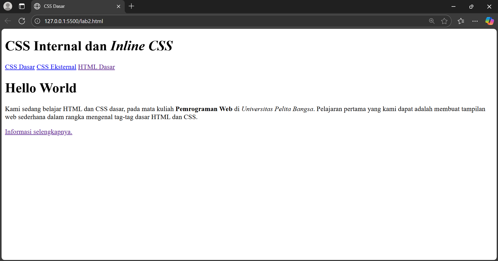
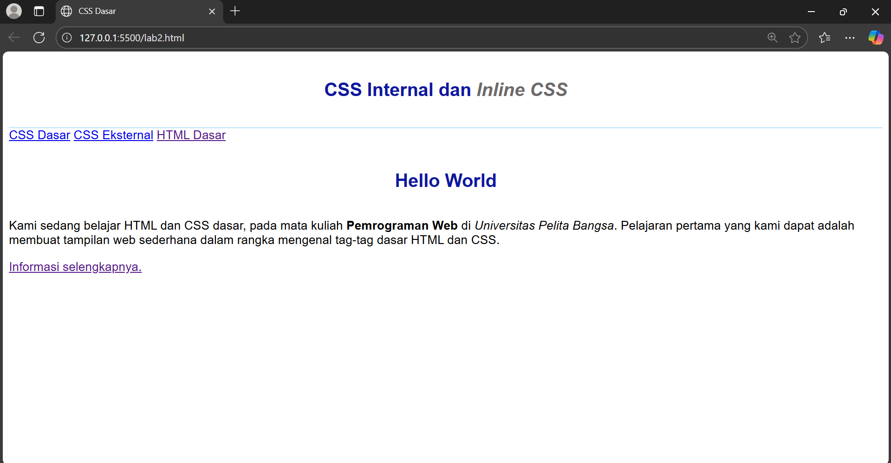
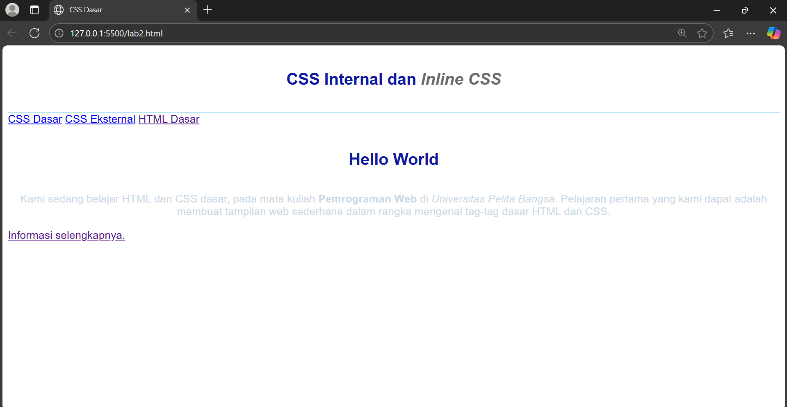
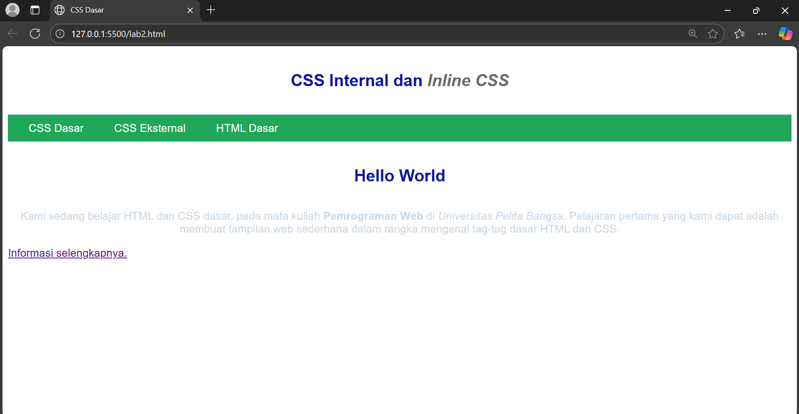
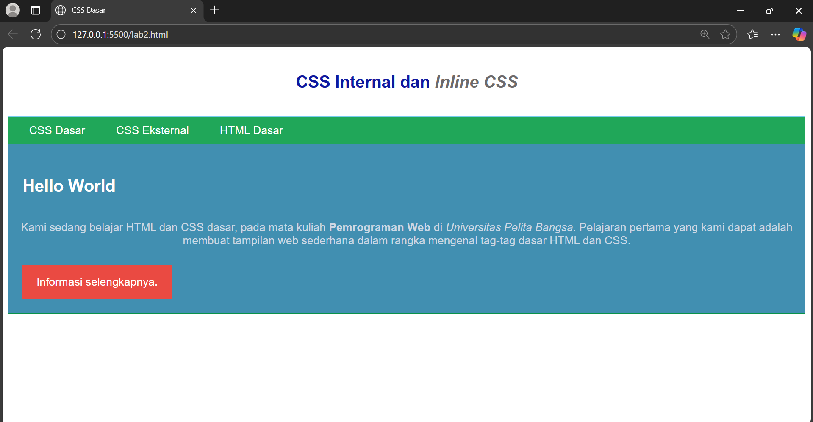

- Nama : Muhamad Nikmal Wahid
- kelas : TI 24 a3
- Pemrograman Web


# Pratikum 2: CSS Dasar

Pada pratikum kedua, kita belajar menggunakan CSS untuk mengatur tampilan web. Dengan CSS kita mengubah warna, ukuran, fontm dan gaya elemen HTML agar halaman terlihat rapi dan menarik. 

## Intruksi Praktikum 
- Siapkan Text editor seperti VScode
- Buat file baru dengan nama lab2_css_dasar.html
- Buat struktur dasar dari dokumen HTML
- Mengikuti langkah-langkah yang tertera
- Lakukan validasi dokumen CSS

## Langkah-langkah Pratikum 
### Membuat dokumen HTML
Langkah pertama kita membuat dokumen HTML dengan nama file  lab2_css_dasar.html dengan struktur sebagai berikut 

```
<!DOCTYPE html>
<html lang="en">
<head>
    <meta charset="UTF-8">
    <meta name="viewport" content="width=device-width, initial-scale=1.0">
    <title>CSS Dasar</title>
</head>
<body>
    <header>
        <h1>CSS Internal <i>Inline CSS</i></h1>
    </header>
    <nav>
        <a href="lab2_css_dasar.html">CSS Dasar</a>
        <a href="lab2_css_eksternal.html">CSS Eksternal</a>
        <a href="lab_tag_dasar_html">HTML dasar</a>
    </nav>
    <!-- CSS ID Selector -->
     <div id="intro">
        <h1>Hello World</h1>
        <p style="text-align: center; color: #ccd8e4;">Kami sedang belajar HTML dan CSS dasar, pada mata kuliah <b>Pemrograman Web</b> di <i>Universitas Pelita Bangsa</i>.Pelajaran pertama yang kami dapat adalah membuaat tampilan web sederhana dalalm rangka mengenal tag-tag dasar HTML dan CSS</p>
        <!-- CSS Class Selector -->
         <a class="button btn-primary" href="#intro">Informasi selengkapnya</a>
     </div>
</body>
</html>
```



### Menambahkan CSS Internal 
Kita bisa menambahkan internal CSS langsung di dalam file HTML, tepatnya di bagian <`head>` dengan menggunakan tag `<style>`

```
<head>
    <title>CSS Dasar</title>
    <style>
        body {
            font-family: 'Open Sans', sans-serif;
        }

        header {
            min-height: 80px;
            border-bottom: 1px solid #77CCEF;
        }

        h1 {
            font-size: 24px;
            color: #0F189F;
            text-align: center;
            padding: 20px 10px;
        }
        h1 i {
            color:#6d6a6b;
        }
    </style>
</head>
```



### Menambahkan Inline CSS
Selain internal, kita juga bisa menambahkan inline CSS langsung di elemen HTML dengan atribut style

```
<p style="text-align: center; color: #ccd8e4;">
```




### Membuat CSS Eksternal
Agar lebih mudah mengelola nya, kita bisa menaruh CSS di file terpisah, misalnya style_eksternal.css. Hal ini mempermudah kita dalam mengubah atau memperbaiki css karena dengan file terpisah menjadi lebih teratur. 

```
nav {
    background: #20a759;
    color: #fff;
    padding: 10px;
}

nav a {
    color: #fff;
    text-decoration: none;
    padding: 10px 20px;
}

nav .active, 
nav a:hover {
    background: #0B6b3a;
}
```
Kemudian di HTML kita tambahkan tag `<link>` untuk menghubungkan ke file CSS nya dan link ini di letakkan di bagian `<head>`



### Menambahkan CSS selector (ID & Class)
Selanjutnya menambahkan CSS Selector menggunakan ID dan Class Selector. Selectot bisa berupa ID (pakai #) atau class (pakai .)

```
#intro {
    background: #418fb1;
    border: 1px solid #099249;
    min-height: 100px;
    padding: 10px;
}

#intro h1 {
    text-align: left;
    border: 0;
    color: #fff;
}

/* Class Selector */
.button {
    padding: 15px 20px;
    background: #bebcbd;
    color: #fff;
    display: inline-block;
    margin: 10px;
    text-decoration: none;
}

.btn-primary {
    background: #ea4a42;
}
```




## Soal 

1. Lakukan eksperimen dengan mengubah dan menambah properti CSS
2. Apa perbedaan pendeklarasian h1 { ... } dengan #intro h1 { ... }?
3. Apabila ada deklarasi CSS secara internal, lalu ditambahkan CSS eksternal dan inline CSS pada elemen yang sama. Deklarasi manakah yang akan ditampilkan pada browser? Berikan penjelasan dan contohnya!
4. Pada sebuah elemen HTML terdapat ID dan Class, apabila masing-masing selector tersebut terdapat deklarasi CSS, maka deklarasi manakah yang akan ditampilkan pada browser? Berikan penjelasan dan contohnya! `( <p id="paragraf-1" class="text-paragraf"> )`

Jawab: 

1. 

2. h1 { ... } berlaku untuk semua elemen `<h1>` di halaman. #intro h1 { ... } hanya berlaku untuk `<h1>` yang berada di dalam elemen dengan id="intro". Jadi lebih spesifik.

3. Kalau ada internal, eksternal, dan inline CSS yang semuanya mengatur elemen yang sama, maka browser akan menampilkan inline CSS karena punya prioritas paling tinggi. 

- Inline CSS (ditulis langsung di elemen dengan style="") → paling kuat.
- Internal CSS (ditulis di tag <style> dalam file HTML).
- Eksternal CSS (ditulis di file .css dan dipanggil dengan <link>).
- Default browser style (paling rendah).

Contoh: 
```
<!DOCTYPE html>
<html lang="en">
<head>
    <meta charset="UTF-8">
    <title>Prioritas CSS</title>
    <link rel="stylesheet" href="style.css">

    <!-- Internal CSS -->
    <style>
        p {
            color: green;
        }
    </style>
</head>
<body>
    <!-- Inline CSS -->
    <p style="color: red;">Teks ini pakai inline CSS</p>
</body>
</html>
```
style.css (eksternal CSS)
```
p {
    color: blue;
}
```

4. Kalau sebuah elemen HTML punya ID dan Class sekaligus, lalu keduanya punya deklarasi CSS yang berbeda untuk properti yang sama, maka aturan dengan selector ID yang akan ditampilkan di browser. Karena selector ID lebih tinggi dibanding Class

```
<!DOCTYPE html>
<html lang="en">
<head>
  <meta charset="UTF-8">
  <title>Prioritas ID vs Class</title>
  <style>
    /* CSS Class */
    .text-paragraf {
      color: blue;
      font-size: 16px;
    }

    /* CSS ID */
    #paragraf-1 {
      color: red;
      font-size: 20px;
    }
  </style>
</head>
<body>
  <p id="paragraf-1" class="text-paragraf">
    Ini contoh paragraf dengan ID dan Class
  </p>
</body>
</html>
```


